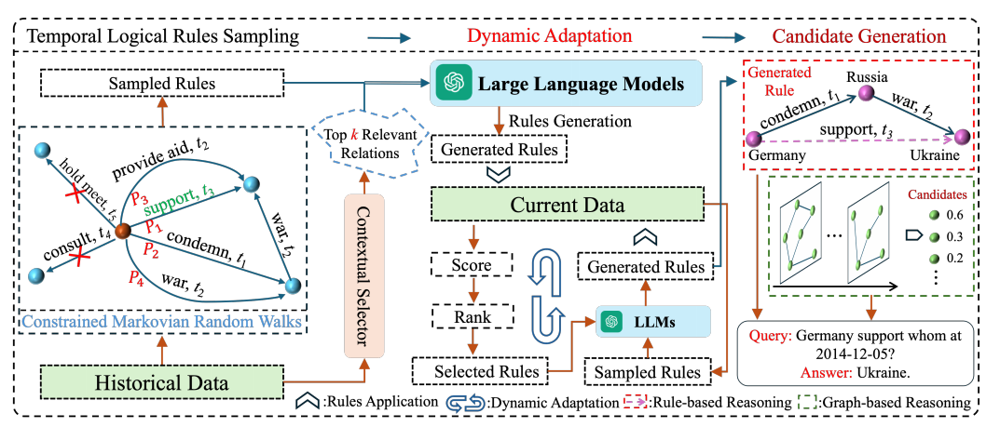
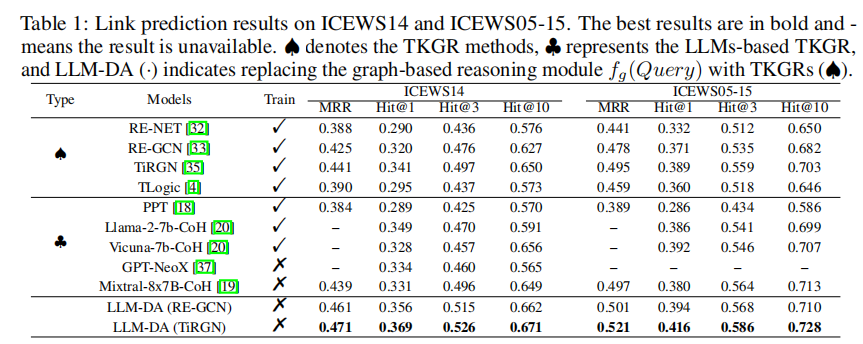

# LDM-DA
Large Language Models-guided Dynamic Adaptation for Temporal Knowledge Graph Reasoning

Official Implementation of "[Large Language Models-guided Dynamic Adaptation for Temporal Knowledge Graph Reasoning](https://arxiv.org/pdf/2405.14170)".



LLM-DA first analyzes historical data to extract temporal rules and utilizes the powerful generative capabilities of LLMs to generate general rules. Subsequently, LLM-DA updates these rules using current data. Finally, the updated rules are applied
to predict future events.

## Requirements
```
pip install -r requirements.txt
```
Set your OpenAI API key in `.env` file

## Mining Rules with LLM-DA
 
1.  Temporal Logical Rules Sampling
```
python rule_sampler.py -d ${DATASET} -m 3 -n 200 -p 16 -s 12 --is_relax_time No
```
2. Rule Generation & Dynamic Adaptation
```
python Iteration_reasoning.py -d ${DATASET} --model_name gpt-3.5-turbo-0125 -f 50 -l 5 --is_rel_name Yes 
```

3. Rank Rules
```
python rank_rule.py -p copy_gpt-3.5-turbo-0125-top-0-f-10-l-10 -d ${DATASET} 
```

4.  Candidate Reasoning
```
python reasoning.py -d ${DATASET} -r confidence.json -l 1 2 3 -p 8 --min_conf 0.01 --weight_0 0.5 --gpu 0 --top_k 20 --window 0
```
5. Evaluate
```
python evaluate.py -d ${DATASET} -c 'llm_test_apply_all_conf_cands_r[1,2,3]_w0_score_12[0.1,0.5,'\''TLogic'\'',0.0,0.01,0]_top_20_et_origin.json' --graph_reasoning_type TiRGN --rule_weight 0.9
```

## Reproduce LLM-DA results with mined rules
###### ICEWS14
```
python rule_sampler.py -d icews14 -m 3 -n 200 -p 16 -s 12 --is_relax_time No
```

```
python Iteration_reasoning.py -d icews14 --model_name gpt-3.5-turbo-0125 -f 50 -l 5 --is_rel_name Yes 
```

```
python rank_rule.py -p copy_gpt-3.5-turbo-0125-top-0-f-10-l-10 -d icews14
```

```
python reasoning.py -p copy_gpt-3.5-turbo-0125-top-0-f-10-l-10 -d icews14 
```

```
python evaluate.py -d icews14  -c 'llm_test_apply_all_conf_cands_r[1,2,3]_w0_score_12[0.1,0.5,'\''TLogic'\'',0.0,0.01,0]_top_20_et_origin.json' --graph_reasoning_type TiRGN --rule_weight 0.9
```

###### ICEWS05-15
```
python rule_sampler.py -d icews0515 -m 3 -n 200 -p 16 -s 12 --is_relax_time No
```

```
python Iteration_reasoning.py -d icews0515 --model_name gpt-3.5-turbo-0125 -f 50 -l 5 --is_rel_name Yes 
```

```
python rank_rule.py -p copy_gpt-3.5-turbo-0125-top-0-f-10-l-10 -d icews0515
```

```
python evaluate.py -d icews0515  -c 'llm_test_apply_all_conf_cands_r[1,2,3]_w0_score_12[0.1,0.5,'\''TLogic'\'',0.0,0.01,0]_top_20_et_origin.json' --graph_reasoning_type TiRGN --rule_weight 0.8
```

## Results


## Bibinfo
If you found this repo helpful, please help us by citing this paper:
```
@misc{wang2024large,
      title={Large Language Models-guided Dynamic Adaptation for Temporal Knowledge Graph Reasoning}, 
      author={Jiapu Wang and Kai Sun and Linhao Luo and Wei Wei and Yongli Hu and Alan Wee-Chung Liew and Shirui Pan and Baocai Yin},
      year={2024},
      eprint={2405.14170},
      archivePrefix={arXiv},
      primaryClass={cs.AI}
}
```

